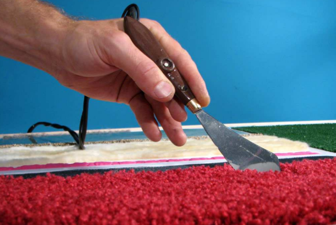
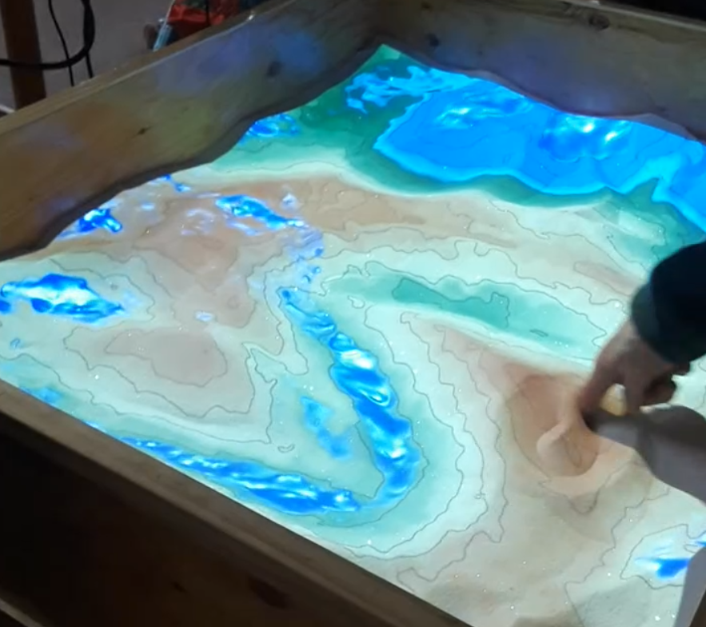
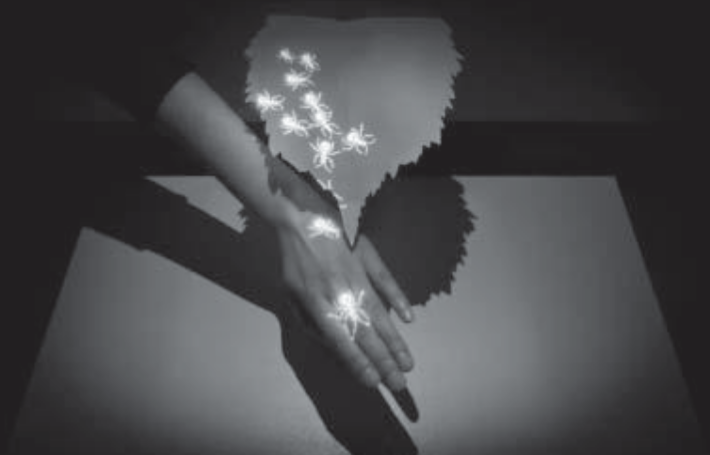
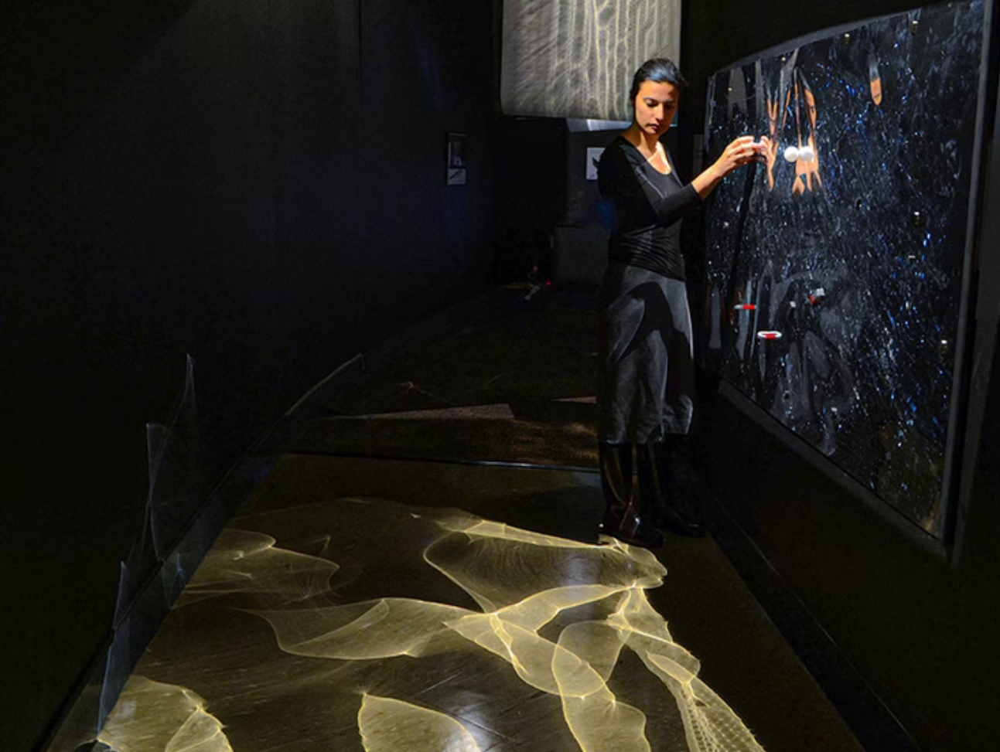

# TOUCHING SOUNDS

Exploring the historical evolution of card suit symbolism throughout different eras and regions of the world, unveiling what hides behind the 4 French suit symbols by triggering material, atmospheric sounds. 

### Interaction
Spinning wheels +  sliding fingers on 3d surfaces.

## Description 

- We are working with materials and sounds. 
- We associated a material to each French card suit.
- Through an interactive 3D board, visitors will be able to choose which material timeline they would like to explore by touching an engraved board. 
- They will trigger visual representations of the symbols that hide behind the classical modern french suits that we mostly know of, embarking on a time journey. 
- Each material will trigger a different sound landscape, that the users will be able to modify by touching different parts of the board. 

### REFERENCES

- [Jelly](https://pinaffo-pluvinage.com/Jelly-6) Pinaffo and Pluvinage

- [The Sound of Touch](https://tangible.media.mit.edu/project/the-sound-of-touch/) David Merrill and Hayes Raffle, Roberto Aimi

- [AR Sandbox at the Dubois Museum](https://uk.pinterest.com/pin/70437487698894/)

- [Temporary Exhibition "World of sound"](https://explorer.technorama.ch/en/ausstellung/temporary-exhibition-world-of-sound)

- [Musee de la main](https://www.museedelamain.ch/download/4hqftg.pdf/verdan-depliant-touch-accueil.pdf)Yuan Li

- [Magnetic Wall, 2014](https://www.yaelerel.com/projects/magnetic-wall) YAEL EREL 

- [Urban Lights Contacts (Annecy) - Scenocosme](https://www.youtube.com/watch?v=_97WWZO3QU0) Gregory Lasserre & Anais met den Ancxt

