# TOUCHING SOUNDS

Exploring the historical evolution of card suit symbolism throughout different eras and regions of the world, unveiling what hides behind the 4 French suit symbols by triggering material, atmospheric sounds. 

### Interaction
Spinning wheels +  sliding fingers on 3d surfaces.

## Description 

- We are working with materials and sounds. 
- We associated a material to each French card suit.
- Through an interactive 3D board, visitors will be able to choose which material timeline they would like to explore by touching an engraved board. 
- They will trigger visual representations of the symbols that hide behind the classical modern french suits that we mostly know of, embarking on a time journey. 
- Each material will trigger a different sound landscape, that the users will be able to modify by touching different parts of the board. 

### REFERENCES

- [Jelly](https://pinaffo-pluvinage.com/Jelly-6) Pinaffo and Pluvinage

- [The Sound of Touch](https://tangible.media.mit.edu/project/the-sound-of-touch/) David Merrill and Hayes Raffle, Roberto Aimi

- [AR Sandbox at the Dubois Museum](https://uk.pinterest.com/pin/70437487698894/)

- [Temporary Exhibition "World of sound"](https://explorer.technorama.ch/en/ausstellung/temporary-exhibition-world-of-sound)

- [Musee de la main](https://www.museedelamain.ch/download/4hqftg.pdf/verdan-depliant-touch-accueil.pdf) Yuan Li

- [Magnetic Wall, 2014](https://www.yaelerel.com/projects/magnetic-wall) YAEL EREL 

- [Urban Lights Contacts (Annecy) - Scenocosme](https://www.youtube.com/watch?v=_97WWZO3QU0) Gregory Lasserre & Anais met den Ancxt

## EVOLUTION of WORK

### 28 October
- we decided on a ROUND, 3D prototype of a board made of 4 different materials. 
- We designed 4 prototyper boards.

| 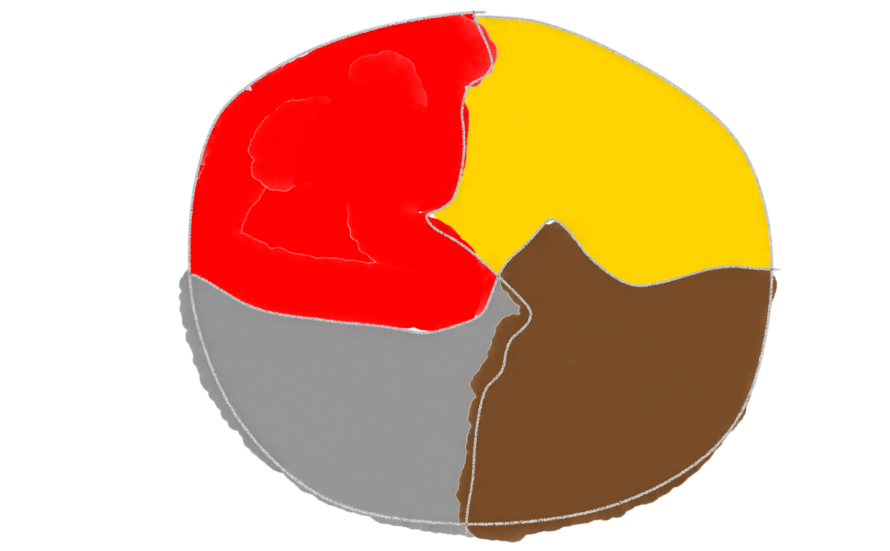 |  |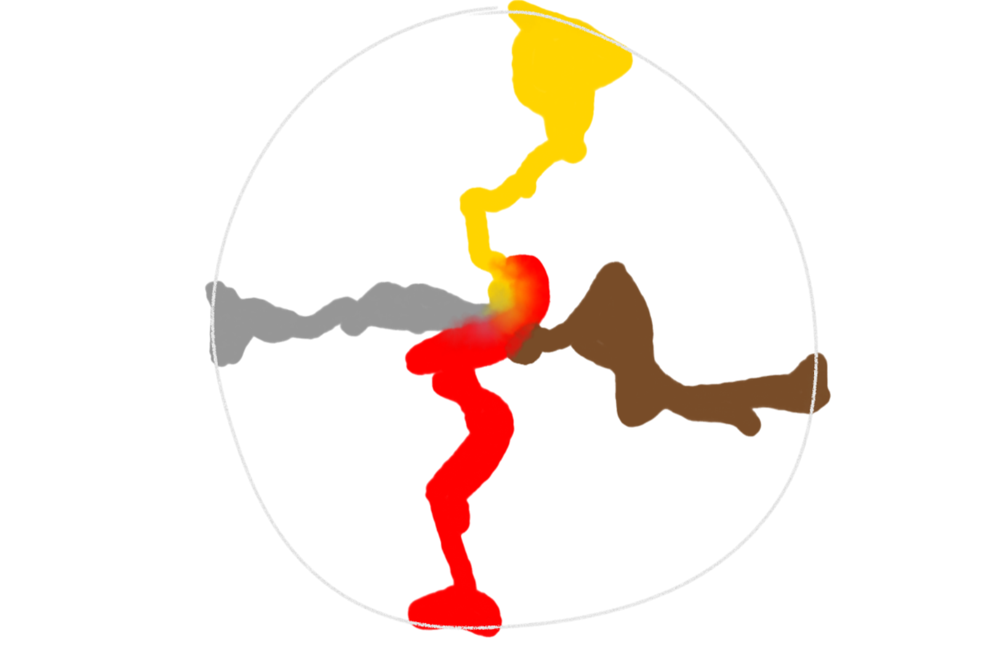 | |
|:---------------------:|:-----------------:|:-----------------:|:-----------------:|

- we managed to do color detection of the background image, and start generating visuals. 

- we tested that the camera projections on the hand. 

| 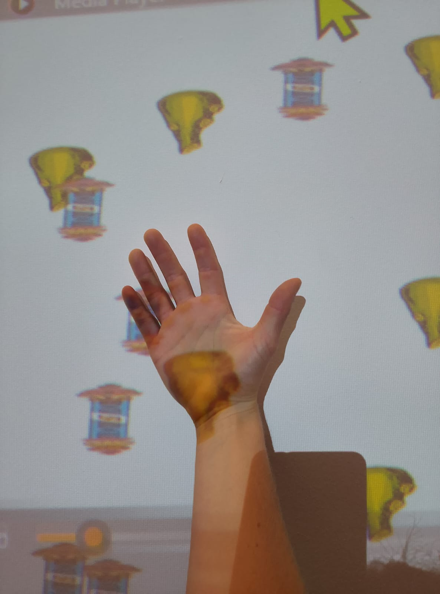 | 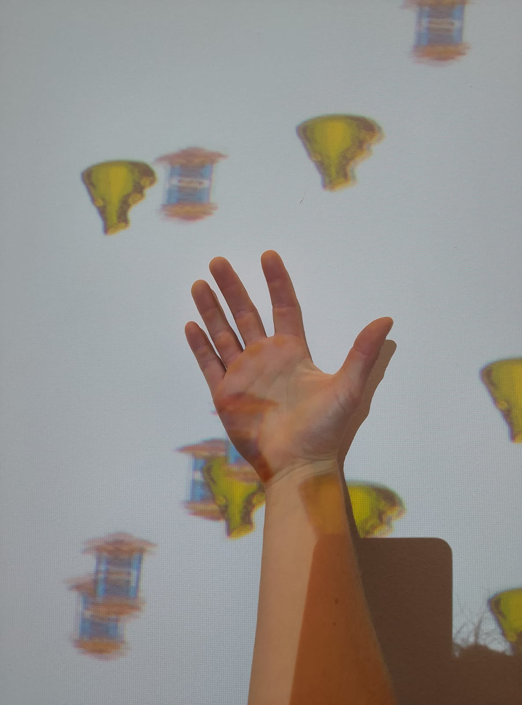 |
|:---------------------:|:-----------------:|

### 04 November

- we tries to do a paper mache workshop, with air baloons stuck on a round surface. We realised it was going to be too messy and the layers would take days to dry out, so we went to the prototyper workshop and discussed materials with them. 
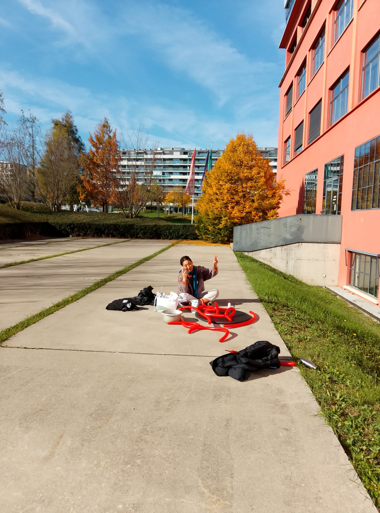

There are 3 printing/engraving techniques, other than the 3D printing whihc would take too long:
1. ZUND - only sharp edges, but goes deep

2. LASER - doesn't go very deep, so hard to make a "material"

3. CNC - 1mx0.5m machine, fast and can cut smooth surfaces (Blender like)

In terms of materials, the prices are as follow: 

| 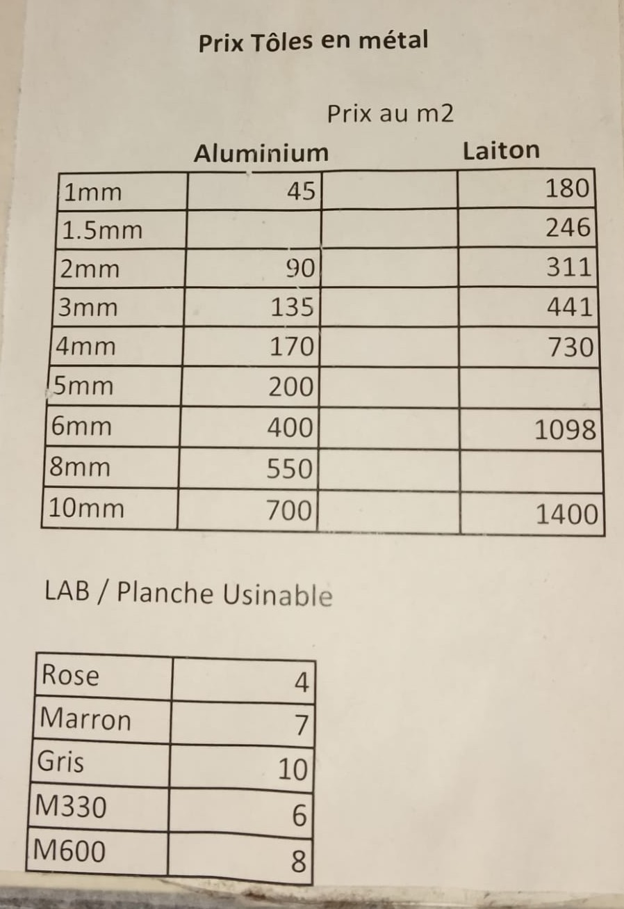 | 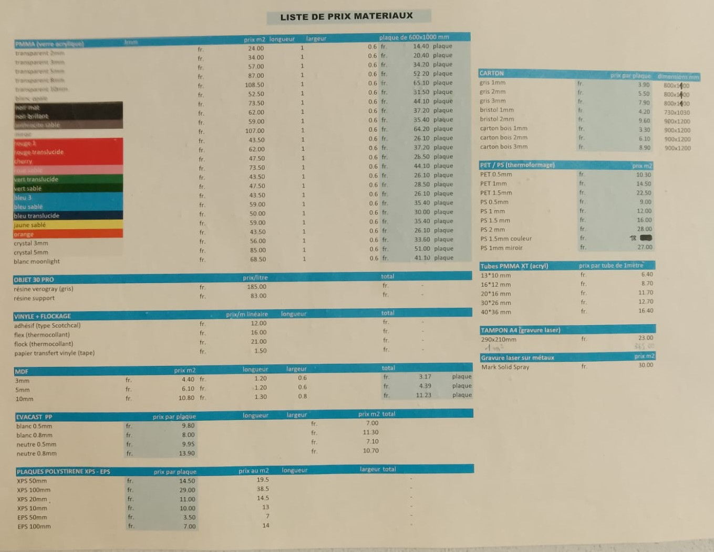 |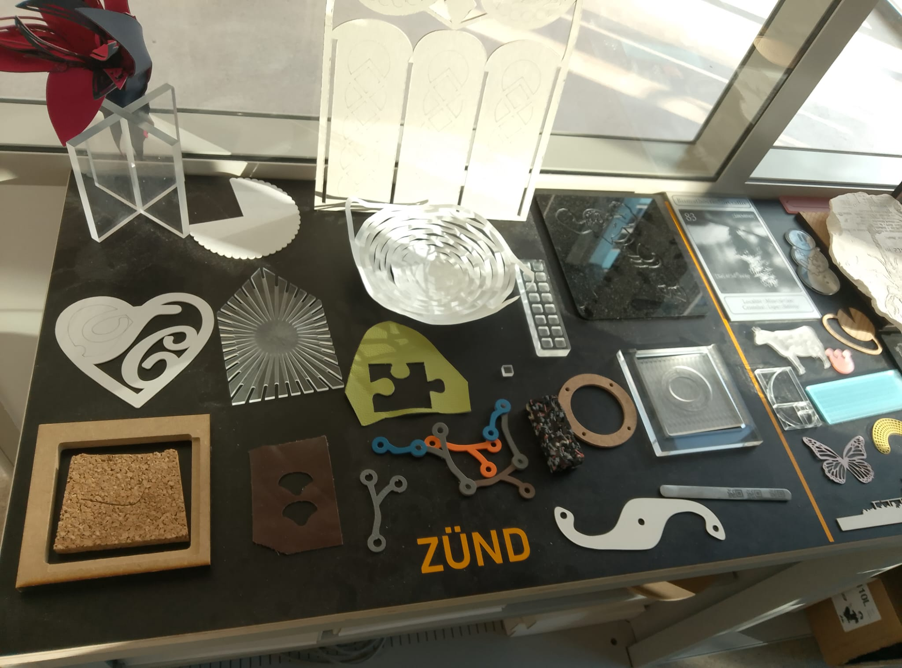 |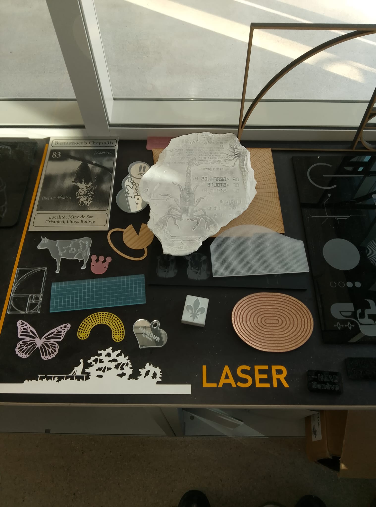 |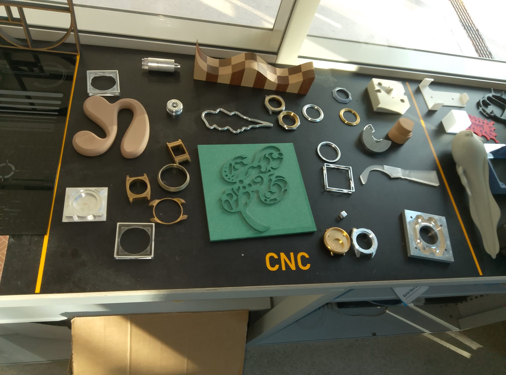 |
|:---------------------:|:-----------------:|:-----------------:|:-----------------:|:-----------------:|

We decided to print in LAB/Planche Usinable, which is cheap and thick, and not to stick materials on top of the round board, but rather make the consistencies with various patterns. In this way, the projector will be more able to project visuals on it as well. 

We need to do:
- making some 3d model surfaces in Blender
- prodce the sound in Gibberish so that it beatmatch when 4 people play at the same time. The sound tests are showing how to change the speed of a song as we move through centuries is hard, whereas changing its note is easier. 
- think about map identity

### 05 November

Blender models shown to the CNC workshop. They say it will not work, therefore working in Fusion. 
|  |  |
|:---------------------:|:-----------------:|

Test version working in STL file on 3D printer for test day. 
|  | 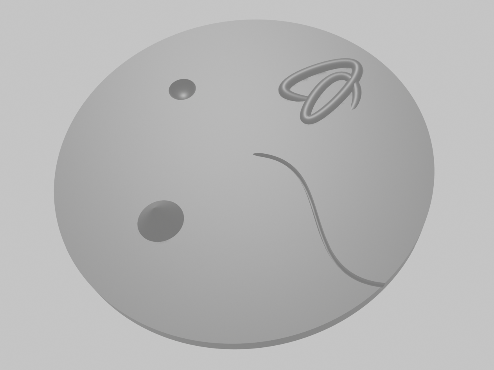 |
|:---------------------:|:-----------------:|

### 6 November - User Tests

- date lines look like mountian heights - maybe add in 2025/present
- we need the 3d model to make people understand how to touch - shall we consider Z distance in finger detection?
- we need an explanatory screen to introduce the story
- the projection is off and it lags the movement of hands
- the music was working well

### 11 November 

- generating videos to project on the surface for a better user journey. 
- the 3D model is taking a lot of time. DISCLAIMER: spent the day with the CNC machine and the girl setting up my Fusion 3D model. We decided use the LAB material because they told us it was 4 CHF per metre squared. Turned out it was 500CHF per metre squared, quite a difference. So I cut my model in 9 parts and used the 3D printer to make it. 

| 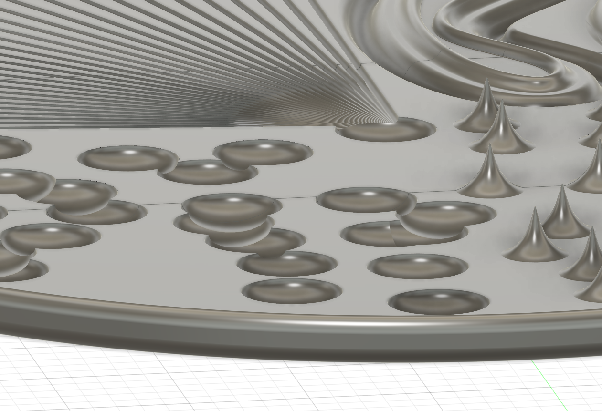 | 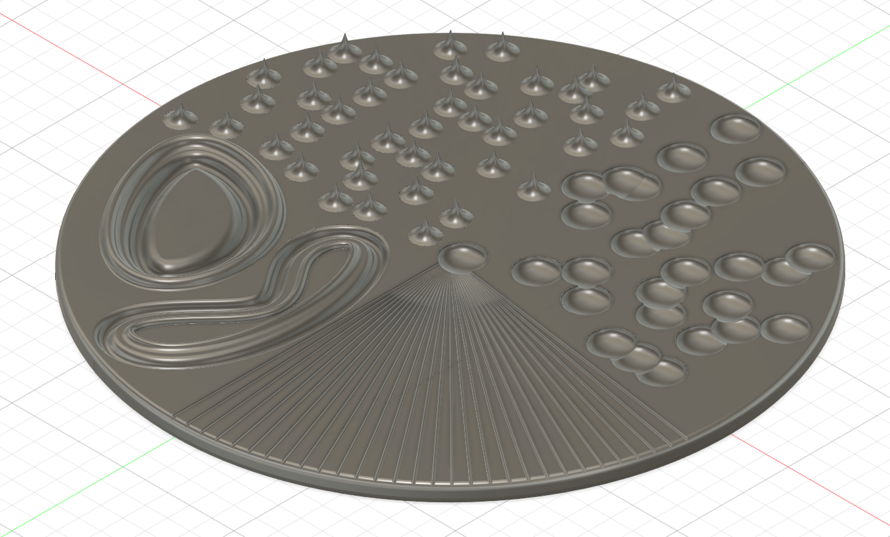 |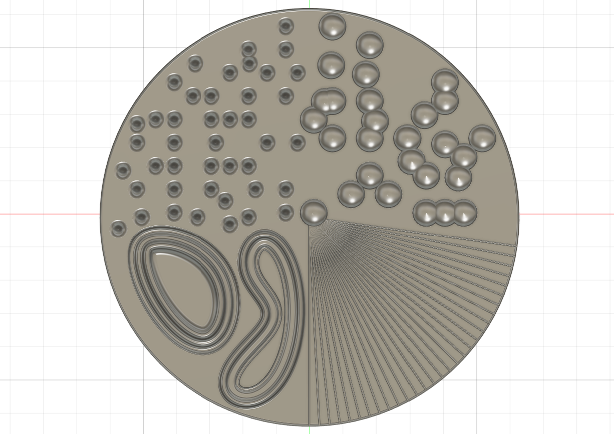 |
|:---------------------:|:-----------------:|:-----------------:|

